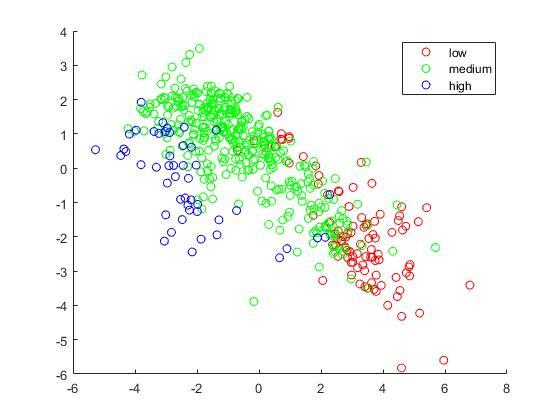

# Intelligent Data Analysis

---

## Lecture 6 : Linear Discriminant Analysis

### 1 . PCA vs LDA

- PCA finds the direction of *maximum variance* of the data.
- LDA finds the direction of *maximum* class separation in the dataset.
- PCA does better in spreading out the data for better visualisation.
- LDA does better in separating the classes of data.

### 2. Linear Discriminant Analysis

- Suppose we have a dataset $X$ where each data point belongs to one of $K$ classes $c_1, ..., c_K$
- Let $X_k$ be the set of data points in $X$ that belong to class $c_k$

$$
X = X_1 \cup X_2 \cup \ ... \ \cup X_K
$$

- Let $C_k$ be the *covariance* matrix of the data set $X_k$
- Define the average **within-class covariance matrix** $C_w$ by

$$
C_w = \frac {C_1+C_2+...+C_K}{K}
$$

- Let $X_b$ be the matrix with $K$ rows whose $k^{th}$ row is the average of vectors in $X_k$
- The **between-class covariance matrix** is the *covariance* matrix $C_b$ of $X_b$

- Intuitively, to separate the classes we want to find a direction in the vector space that, simultaneously,
  - Maximises the between-class variance ($C_b$)
  - Minimises the within-class variance ($C_w$)
- The vector that has this property is the **eigenvector** of $C_bC_w^{(-1)}$ corresponding to the biggest eigenvalue.

- Notice, with LDA, the number of non-zero eigenvalues will be no greater than $c-1$. (Rank of covariance matrix)

|  |
| :------------------------------------------------: |
|           *Fig 1. LDA on Boston Dataset*           |

### 3. Data Visualisation

- i-vector

  - Replace maximum variance criterion with a **probability-based** criterion.

- Neural networks

  - Encoder - decoder

- t-SNE

  - Given a set of $N$ high-dimensional objects $\mathbf x_1, ..., \mathbf x_N$, the similarity of data point $x_j$ to data point $x_i$ is the conditional probability $p_{j|i}$, that $x_i$ would pick $x_j$ as its neighbour if neighbours were picked in proportion to their probability density under a Gaussian centred at $x_i$:

  $$
  p_{j|i} = \frac {exp{(-\Vert x_i-x_j\Vert^2)}/{2\sigma^2}}{\Sigma_{k\ne i} {exp(-\Vert x_k - x_l \Vert^2)}/{2\sigma^2}}
  $$

  
  
  - The probabilities $p_{ij}$ for high-dimensional data
  
  $$
p_{ij} = \frac {p_{j|i} + p_{i|j}}{2N}
  $$
  
  
  
  
  - Given a $d$-dimensional map $\mathbf y_1, ..., \mathbf y_N$ that reflects the similarities $p_{ij}$ as well as possible, it measures similarities $q_{ij}$ between two points in the map:
  
  $$
  q_{ij} = \frac {(1+\Vert y_i - y_i \Vert^2)^{-1}}{\Sigma(1+ \Vert y_k - y_l \Vert ^2)^{-1}}
  $$
  
  
  
  
  - The similarities between low-dimensional points are measured by t-distribution in order to allow dissimilar objects to be modelled far apart in the map
  
  $$
  PDF_t = \frac {\Gamma(\frac {v+1}{2})}{\sqrt {v\pi}\Gamma(\frac v 2)}(1+\frac {t^2} {v})^{\frac{-(v+1)}{2}}
  $$
  
  - The locations of the points $\mathbf y_i$ are determined by minimising the *Kullback-Leibler divergence* of the distribution $Q$ from the distribution $P$:
  
  $$
  Min:KL(P\Vert Q) = \Sigma_{i\ne j}p_{ij}log\frac{p_{ij}}{q_{ij}}
  $$
  
  - The minimisation is performed using gradient descent. 
